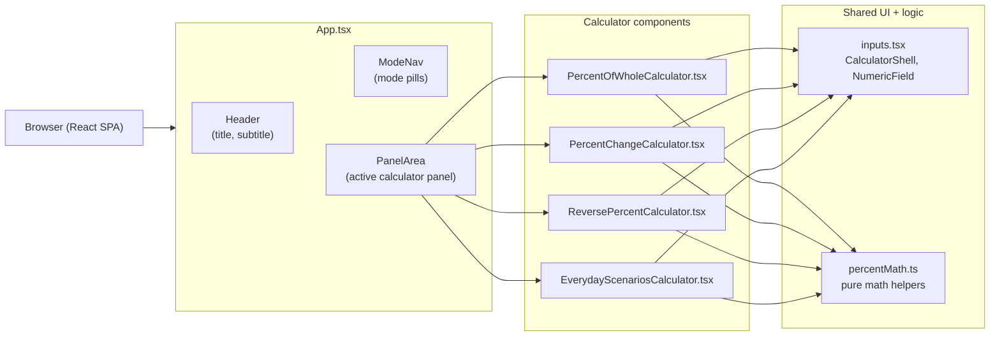

## Percent Studio – Percent calculator

A small React + TypeScript + Vite app for working with percentages in a few focused ways (part/whole, percent change, reverse percent, and everyday scenarios like tips and discounts).

### Prerequisites

- **Node.js** 18+ (or any version compatible with Vite 7)
- **npm** (bundled with Node)

### Install dependencies

```bash
npm install
```

### Run the app (development)

```bash
npm run dev
```

Then open the URL printed in the terminal (by default `http://localhost:5173`).

### Build for production

```bash
npm run build
```

To preview the production build locally:

```bash
npm run preview
```

### Linting

```bash
npm run lint
```

### Testing

Run the test suite:

```bash
npm test
```

Run tests with the Vitest UI:

```bash
npm run test:ui
```

---

### Running with Docker

You can run the app as a containerized, production-style build using the provided `Dockerfile` and `docker-compose.yml`.

#### Build and run with Docker only

From the project root:

```bash
docker build -t percent-calculator .
docker run --rm -p 8080:80 percent-calculator
```

Then open `http://localhost:8080` in your browser.

#### Using docker-compose

```bash
docker compose up --build
```

This will:

- Build the image from the local `Dockerfile`
- Start the `percent-calculator` service
- Expose it on `http://localhost:8080`

---

### Architecture overview

At a high level, the app is a single-page React application with a layout shell, a navigation area for selecting calculator modes, and individual calculator panels that use shared input and math utilities.



Key points:

- **`App.tsx`** owns the active mode state and overall layout.
- **Calculator components** each handle one type of percent workflow and use shared presentation via `CalculatorShell` and `NumericField`.
- **`percentMath.ts`** contains pure functions for the underlying percentage calculations, making them easy to test with Vitest.
